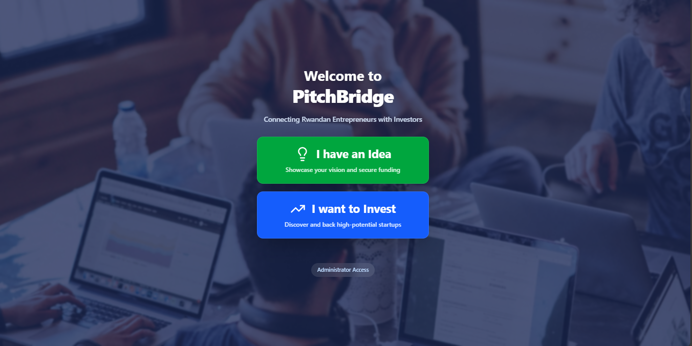
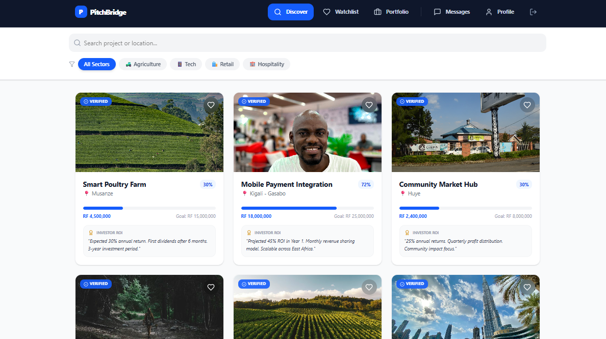
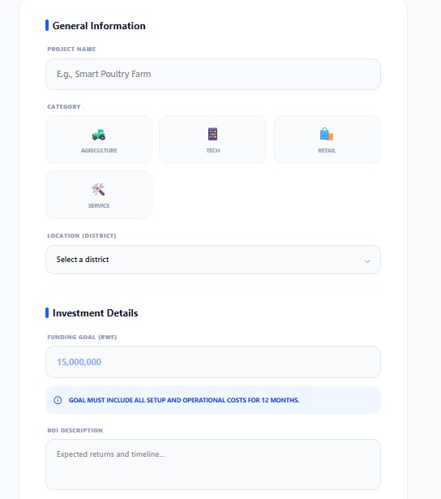
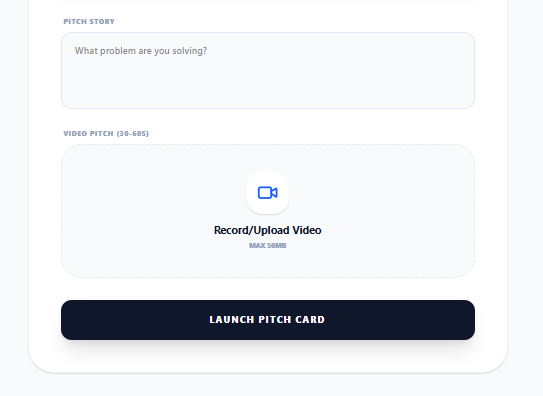
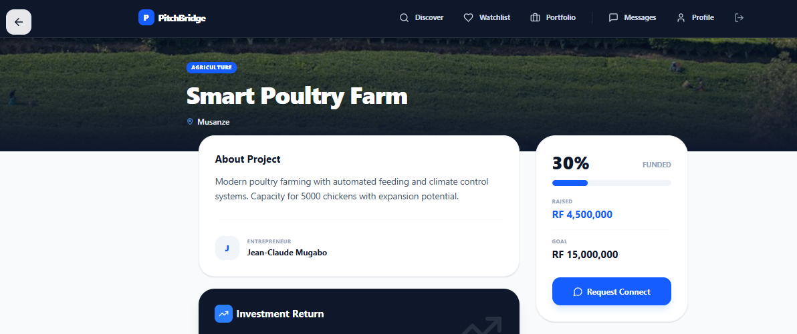

# PitchBridge

**Bridging the Gap Between Rwandan Entrepreneurs and Investors.**

PitchBridge is a specialized fintech platform designed to empower local entrepreneurs by providing a high-visibility stage for their projects, while offering investors a streamlined, data-driven "Discovery Feed" to find their next high-impact investment in Rwanda.

---

## 🔗 Repository

**GitHub URL:** [https://github.com/NadiaTeta/PitchBridge.git](https://github.com/NadiaTeta/PitchBridge.git)

---

## 📝 Description

PitchBridge solves the visibility gap in the Rwandan startup ecosystem. Entrepreneurs often lack access to professional investors, while investors struggle to find vetted, high-potential projects outside of their immediate networks.

**Key Features:**

- **Dual-Persona Dashboards:** Specialized interfaces for Entrepreneurs (pitch creation) and Investors (discovery & portfolio).
- **Video Pitches:** Integrated 30-60 second video support to humanize the pitching process.
- **Smart Filtering:** Find projects by Rwandan Districts (Kigali, Rubavu, Musanze, etc.) and industry categories.
- **Real-time Interaction:** Direct chat interface for investor-founder communication.
- **Responsive Navigation:** A mobile-optimized experience with a unified top-bar and hamburger menu.

---

## ⚙️ Environment & Project Setup

### 1. Prerequisites

- **Node.js**: v18.0.0 or higher
- **npm**: (Standard with Node)
- **MongoDB**: (local or Atlas for backend)

### 2. Installation

Clone the repository and install the necessary dependencies:

```bash
# Clone the repo
git clone https://github.com/NadiaTeta/PitchBridge.git

# Enter the directory
cd PitchBridge

# Backend
cd backend
npm install

# Frontend
cd ../frontend
npm install
```

### 3. Environment configuration (optional)

Although the app can run with mock data for the demo, the architecture is ready for backend integration. To set up the environment variables:

**Backend** – Create a `.env` file in the `backend/` directory:

```env
NODE_ENV=development
PORT=5000
MONGODB_URI=mongodb://localhost:27017/pitchbridge
JWT_SECRET=your-secret-key
CLIENT_URL=http://localhost:5173
API_VERSION=v1

# Email – real SMTP (verification codes and emails go to users' actual inbox; Mailtrap not used)
# Use Gmail (with App Password), SendGrid, Outlook, or your provider. See backend/.env.example.
EMAIL_HOST=smtp.gmail.com
EMAIL_PORT=587
EMAIL_USER=your-email@gmail.com
EMAIL_PASSWORD=your-app-password
EMAIL_FROM=PitchBridge <noreply@yourdomain.com>
```

Registration requires a real email: temporary/disposable addresses (e.g. Mailinator, 10minutemail) are rejected so verification codes can be delivered to users' actual inboxes.

**Frontend** – Create a `.env` file in the root directory (or in `frontend/`) if needed:

```sh
VITE_USE_MOCK_DATA=true
# Optional: VITE_API_URL=http://localhost:5000
```

### 4. Running the App

**Backend** (from `backend/`):

```sh
npm run dev
# Or: npm start
```

API runs at `http://localhost:5000` (health: `http://localhost:5000/health`).

**Frontend** (from `frontend/`):

```sh
npm run dev
```

Open http://localhost:5173 in your browser.

Use both together for full functionality (auth, projects, chat, uploads).

---

## 🏗️ Technical Stack

**Frontend:** React + TypeScript (Vite)

**Styling:** Tailwind CSS

**State:** React Context API (Auth & Data)

**Routing:** React Router DOM (Protected Layouts)

**Backend:** Node.js, Express, Mongoose (MongoDB), Socket.IO, JWT, bcryptjs, Multer, Nodemailer

| Layer     | Technologies                                                                 |
|----------|-------------------------------------------------------------------------------|
| Frontend | React 18, TypeScript, Vite, React Router 7, Tailwind CSS 4, Radix UI, MUI, Axios, Socket.IO client, Lucide React |
| Backend  | Node.js (≥18), Express, Mongoose (MongoDB), Socket.IO, JWT, bcryptjs, Multer, Nodemailer, Helmet, CORS, compression, express-rate-limit |
| Auth     | JWT, email verification, role-based (entrepreneur, investor, admin), document verification & approval |

---

## 📁 Project Structure

```
PitchBridge/
├── frontend/                 # React (Vite + TypeScript) SPA
│   ├── index.html
│   ├── package.json
│   ├── vite.config.ts
│   ├── tailwind.config.js
│   ├── postcss.config.mjs
│   └── src/
│       ├── main.tsx
│       ├── app/
│       │   ├── App.tsx           # Routes & layout
│       │   ├── context/
│       │   │   └── AuthContext.tsx
│       │   ├── components/
│       │   │   ├── OnboardingScreen.tsx
│       │   │   ├── Register.tsx
│       │   │   ├── Login.tsx
│       │   │   ├── EmailVerification.tsx
│       │   │   ├── DocumentUpload.tsx
│       │   │   ├── WaitingApproval.tsx
│       │   │   ├── Dashboard.tsx
│       │   │   ├── Navbar.tsx
│       │   │   ├── Footer.tsx
│       │   │   ├── PitchCardCreator.tsx
│       │   │   ├── EntrepreneurProjectDetails.tsx
│       │   │   ├── InvestorDiscoveryFeed.tsx
│       │   │   ├── ProjectDetails.tsx
│       │   │   ├── ProjectCard.tsx
│       │   │   ├── Watchlist.tsx
│       │   │   ├── Portofolio.tsx
│       │   │   ├── Messages.tsx
│       │   │   ├── ChatInterface.tsx
│       │   │   ├── UserProfile.tsx
│       │   │   ├── AdminDashboard.tsx
│       │   │   ├── AboutPage.tsx
│       │   │   └── ContactPage.tsx
│       │   ├── hooks/
│       │   │   ├── useProjects.ts
│       │   │   └── useProjectActions.ts
│       │   ├── services/
│       │   │   ├── api.ts
│       │   │   └── socket.ts
│       │   ├── utils/
│       │   │   ├── errorHandler.ts
│       │   │   └── fileUpload.ts
│       │   └── data/
│       │       ├── userData.ts
│       │       └── mockData.ts
│       └── styles/
│           ├── index.css
│           ├── tailwind.css
│           ├── theme.css
│           └── fonts.css
│
├── backend/                  # Node.js + Express API
│   ├── package.json
│   ├── src/
│   │   ├── server.js         # App entry, Socket.IO, DB connect
│   │   ├── controllers/
│   │   │   ├── auth.controller.js
│   │   │   ├── user.controller.js
│   │   │   ├── project.controller.js
│   │   │   ├── investment.controller.js
│   │   │   ├── chat.controller.js
│   │   │   ├── admin.controller.js
│   │   │   └── upload.controller.js
│   │   ├── models/
│   │   │   ├── User.model.js
│   │   │   ├── Project.model.js
│   │   │   ├── Investment.model.js
│   │   │   ├── Chat.model.js
│   │   │   └── document.model.js
│   │   ├── routes/
│   │   │   ├── auth.routes.js
│   │   │   ├── user.routes.js
│   │   │   ├── project.routes.js
│   │   │   ├── investment.routes.js
│   │   │   ├── chat.routes.js
│   │   │   ├── admin.routes.js
│   │   │   └── upload.routes.js
│   │   ├── middleware/
│   │   │   ├── error.middleware.js
│   │   │   ├── rateLimiter.middleware.js
│   │   │   └── multer.middleware.js
│   │   └── utils/
│   │       ├── email.js
│   │       ├── fileUpload.js
│   │       └── (other helpers)
│   └── uploads/               # Local file uploads (documents, profile)
│
├── README.md
├── ATTRIBUTION.md
└── LICENSE
```

---

## 🔌 API Structure

Base path: `/api/v1` (configurable via `API_VERSION`).

| Prefix         | Purpose |
|----------------|--------|
| `/auth`        | Register, login, verify-email, resend-verification, upload-docs, me, logout, update-password, forgot/reset password |
| `/users`       | Profile (get/update), profile picture, watchlist, portfolio |
| `/projects`    | List, search, get by id, create, update, delete, increment views |
| `/investments` | Create, my-investments, get by id, agree-terms; project investments (entrepreneur); status (admin) |
| `/chat`        | List chats, get chat, create chat, send message, mark read |
| `/admin`       | Pending verifications (projects/users), approve/reject projects and users, document approve/reject, user suspend/activate, stats |
| `/upload`      | Document, video, image upload; delete file |

**Health:** `GET /health` — API status.

**Static:** `/uploads` — served files (e.g. documents, profile images).

---

## 🗺️ Frontend Routes

| Path | Description |
|------|-------------|
| `/` | Onboarding (mission, vision, about; register/login links) |
| `/about` | About PitchBridge |
| `/contact` | Contact form & info |
| `/register` | Register (role from `?role=entrepreneur` or `investor`) |
| `/login` | Login |
| `/verify-email` | Email verification code |
| `/upload-documents` | Document upload (selfie, NIDA, optional TIN) |
| `/waiting-approval` | Pending admin approval (logout → login) |
| `/dashboard` | Role-based dashboard |
| `/entrepreneur/pitch-card` | Create/edit project |
| `/entrepreneur/project/:id` | Entrepreneur's project details (edit/delete) |
| `/investor/discover` | Discovery feed (filter by location, etc.) |
| `/project/:id` | Public project details (investor view) |
| `/watchlist` | Investor watchlist |
| `/portfolio` | Investor portfolio |
| `/messages`, `/messages/:id` | Chat list and conversation |
| `/chat`, `/chat/:id` | Chat UI |
| `/profile`, `/profile/:id/:viewType` | Own profile / public profile |
| `/admin/dashboard` | Admin verification and management |

---

## 🎨 Designs

### 1. App interfaces










### 2. Database Schema


---

## 🚀 Deployment Plan

**Phase 1: Frontend Hosting**

The frontend is designed to be hosted on Vercel.

Automatic deployments are triggered via the main branch.

- **Build Command:** `npm run build`
- **Output Directory:** `dist`

**Phase 2: Media & Video Management**

Video pitches are managed via Cloudinary. This ensures that high-resolution videos are optimized and served via CDN to users with varying internet speeds across Rwanda.

**Phase 3: Backend & Database**

The backend (Node.js/Express) will be deployed on Render or Heroku, connected to a PostgreSQL database for secure management of investment data and user profiles.

**Phase 4: Domain & Security**

Final deployment will involve a custom domain with SSL encryption (HTTPS) to ensure that all financial discussions and personal NID/RDB verification documents are handled securely.

---

## 📹 Video demo link

Video demo: [https://drive.google.com/file/d/1cQ0wKVBeQPxWm8F5QCoH5ot2aTN1aXK_/view?usp=sharing](https://drive.google.com/file/d/1cQ0wKVBeQPxWm8F5QCoH5ot2aTN1aXK_/view?usp=sharing)

---

## 📄 License and attribution

- **License:** MIT. See [LICENSE](LICENSE).
- **Third-party software:** See [ATTRIBUTION.md](ATTRIBUTION.md) for dependencies and their licenses.
